> ⚠️ **SUPERSEDED** by `quartersmart-positioning-playbook.md` (more detailed, current).
> ⚠️ **OWNER OVERRIDE (2026-06-08): NO LMS AT ALL.** This blueprint's advice to "keep the current
> training-system/LMS pages live as a secondary solution page" is **rejected** — QuarterSmart is not to
> be positioned, named, or described around an LMS, course studio, or training-content product anywhere.
> Kept here for reference/provenance only.

# Dual Logic Audit and QuarterSmart Positioning Blueprint

## Executive summary

Dual Logic’s public positioning is unusually coherent for a boutique AI consultancy. It does not present itself as a training vendor, a software reseller, or a pure engineering shop. Instead, it frames itself as a full-service AI integration and transformation partner that helps organizations move from AI curiosity to operational capability through four linked service pillars: strategy, implementation, training, and engineering. Its homepage, services pages, and About page consistently stress measurable outcomes, people-first change management, internal capability building, and long-term partnership rather than one-off deliverables. Its LinkedIn profile further reinforces that it is a small-to-mid-market consultancy founded in 2024, based in Washington, DC, with a small team footprint rather than a large systems-integrator posture. citeturn1view0turn18view3turn5view3turn23view0turn11view0

The most important commercial lesson from Dual Logic is not the wording of any single service page. It is the architecture of the offer. Publicly, Dual Logic bridges three buyer anxieties at once: **what should we do, how do we train our people, and who will help us execute without creating chaos**. Its customer stories support that interpretation. The ACS Publications story centers readiness, fluency, surveys, and a roadmap for a 400-person division; the Emburse story centers leadership enablement, internal champions, governance, and a 2026 roadmap for an 800-person company; the CoSo Cloud story centers build-vs-buy selection inside compliance constraints; and the Paperclip story shows embedded execution with roughly 50 hours a month of AI-augmented operational support and measurable funnel outcomes. citeturn8view0turn9view0turn10view0turn8view1turn9view1

Dual Logic’s pricing posture is also revealing. I did **not** find transparent public pricing on the core service, contact, or customer-story pages reviewed. Instead, the site pushes discovery calls, custom scoping, ongoing reviews, and retainer-style support. One implementation page explicitly mentions retainer-based optimization and expansion, and one case study describes embedded monthly execution. That combination strongly suggests a discovery-led, senior-led, mid-market consulting model rather than a low-ticket workshop catalog or commodity automation shop. I excluded the `/resources/events/example-workshop-event/` page from price conclusions because the URL and placeholder-like details indicate it is a template/example page, not a reliable live-offer signal. citeturn24view0turn24view1turn24view2turn24view3turn22view2turn8view1turn26search0

QuarterSmart, by contrast, is **already strong in the thesis** but misaligned in the public packaging. Its current site leads with “AI-powered LMS” and “course development studio,” compares itself with LMS vendors, and publicly anchors pricing at roughly **$2,500–$4,000** for a buildout and **$800–$1,500/month** for a managed service. At the same time, its content already argues something much closer to Dual Logic’s worldview: enablement matters, AI chatbots should be grounded in SOPs, deployment should happen in Slack or Teams, and unresolved questions should become operational feedback loops. That means QuarterSmart does **not** need a new philosophy. It needs a new market-facing noun, a new package ladder, and better business-outcome proof. citeturn28view0turn28view1turn29view0turn28view2turn28view3

The recommended move is to reposition QuarterSmart as an **AI implementation and adoption partner for operational teams**, not as an LMS product company. In that model, LMS-style training delivery becomes an optional implementation artifact rather than the lead offer. The core ladder should become: **paid readiness sprint → measurable pilot → rollout partnership**. That package architecture fits Dual Logic’s public strengths, fits QuarterSmart’s existing “free audit/no pitch” motion, and creates room to raise price and authority without pretending to be a large consultancy. The public benchmark firms reviewed for calibration support that shift: BridgeView publishes a progression from a $3,500 education workshop to a $15,000 discovery engagement and $30,000+ proof-of-concept; TKXEL publicly shows a one-day workshop moving into a two-week design phase and then a four- to six-week proof-of-value; Tech 42 leads with strategy-session-plus-ROI-projection messaging; Elansio and Improving show how training can anchor a lead offer without collapsing the whole company into commoditized course pricing. citeturn17view0turn15view2turn17view1turn15view4turn15view3

### Method and prioritized sources

I prioritized Dual Logic’s own website, service pages, customer stories, and company LinkedIn for factual analysis. I used a small set of similar consultancies only to calibrate package design, pricing signals, and rollout cadence. I also reviewed QuarterSmart’s current public site because your request is not just to analyze Dual Logic, but to recommend a concrete public-facing offer for QuarterSmart. citeturn1view0turn5view3turn9view1turn11view0turn28view0turn29view0

| Prioritized source | Why it mattered |
|---|---|
| Dual Logic homepage and Why Dual Logic pages citeturn1view0turn23view0 | Core positioning, sales messaging, “partner for the journey” posture, outcome language, people-first framing |
| Dual Logic services overview citeturn5view3 | Four-pillar service architecture and industry list |
| Dual Logic strategy page citeturn6view2turn22view0 | Readiness, use-case prioritization, governance, roadmap, strategic review model |
| Dual Logic implementation page citeturn6view0turn22view2 | Tool selection, integration, automation, rollout, monitoring, retainer support |
| Dual Logic training page citeturn6view3turn22view1 | Leadership enablement, workshops, champions, cohorts, ongoing resources |
| Dual Logic engineering page citeturn6view4turn22view3 | Custom systems, agents, RAG, security/compliance posture |
| Dual Logic customer stories hub and flagship cases citeturn9view1turn8view0turn8view1turn9view0turn10view0turn10view1 | Outcomes, case-study structure, timelines, engagement style, target customer clues |
| Dual Logic LinkedIn company page citeturn11view0 | Company size, founding year, small-to-mid-sized organization focus, visible team footprint |
| QuarterSmart homepage, vs-LMS page, pricing page, and blog citeturn28view0turn28view1turn29view0turn28view2turn28view3 | Current public positioning, public price anchors, current proof language, current CTA posture |
| BridgeView, TKXEL, Tech 42, Elansio, Improving, Alice Labs, and Google Search Central docs citeturn17view0turn15view2turn17view1turn15view4turn15view3turn15view0turn35search0turn35search5turn35search7 | Benchmark packaging, transparent workshop/discovery price signals, rollout timelines, and structured-data/entity recommendations |

## Dual Logic public audit

Dual Logic’s public footprint shows a boutique AI consultancy that is trying to own the middle ground between executive strategy, workforce enablement, practical implementation, and custom build work. That is a strong place to sit commercially because it captures both the **change-management budget** and the **execution budget**. The public evidence also suggests that the firm deliberately avoids commoditizing itself with visible rate cards; instead it sells confidence, clarity, and embedded capability-building to small and mid-sized organizations. citeturn23view0turn5view3turn11view0

### Service and component matrix

| Component | Strategy | Implementation | Training | Engineering | Public evidence and audit read |
|---|---|---|---|---|---|
| Assessment | **Strong** | Moderate | Light | Light | Dual Logic explicitly offers AI readiness assessment, current-state diagnostics, stakeholder interviews, and readiness scorecards. citeturn6view2turn21view3 |
| Strategy | **Strong** | Moderate | Light | Moderate | The strategy page covers opportunity mapping, competitive threats, build-vs-buy-vs-partner analysis, KPI scoping, governance, and phased roadmaps. citeturn21view3turn22view0 |
| Training | Light | Light | **Strong** | Light | The training page is robust: leadership enablement, role-specific workshops, org-wide fluency, learning paths, champion development, coaching cohorts, and durable resources. citeturn6view3turn21view4turn22view1 |
| Pilot | Moderate | **Strong** | Moderate | Moderate | The implementation page refers to proof-of-concept testing, pilot groups, validation, and first-weeks rollout support; customer stories show leadership-first and team-first phased pilots. citeturn6view0turn22view2turn9view0turn8view0 |
| Rollout | **Strong** | **Strong** | **Strong** | Moderate | Rollout is embedded across strategy roadmaps, implementation support, leadership-first sequencing, champions, communities of practice, and quarterly reviews. citeturn22view0turn22view2turn9view0 |
| Governance | **Strong** | Moderate | **Strong** | **Strong** | Governance appears across strategy, industry pages, Emburse training design, and engineering security/compliance work. It is not an afterthought; it is sold as part of adoption. citeturn22view0turn1view5turn9view0turn22view3 |
| Automation | Light | **Strong** | Moderate | **Strong** | Implementation emphasizes workflow automation, APIs, native integrations, dashboards, and ongoing optimization; engineering extends this into agents and RAG systems. citeturn21view2turn22view2turn22view3 |
| Custom build | Light | Moderate | Light | **Strong** | Engineering covers custom applications, AI agents, RAG, compliance architecture, and fine-tuning when required. citeturn21view5turn22view3 |

### Core audit by dimension

| Dimension | What the public sources show | Audit takeaway |
|---|---|---|
| Company overview | Dual Logic describes itself as a full-service AI integration consultancy helping organizations move from curiosity to capability. LinkedIn describes it as an AI transformation consultancy for small to mid-sized organizations, founded in 2024, headquartered in Washington, DC, with company size listed as 2–10 employees. citeturn18view3turn11view0 | Senior-led boutique, not enterprise theater |
| Core services | Strategy, Implementation, Training, and Engineering are the visible four pillars across the site. citeturn5view3 | Clean architecture; easy for buyers to understand |
| Pricing and packaging signals | No transparent pricing was surfaced on the core services, contact, or customer-story pages reviewed. The implementation page references retainer-based support. Paperclip’s case study describes roughly 50 hours per month of embedded execution. citeturn24view0turn24view1turn24view2turn24view3turn22view2turn8view1 | Discovery-led custom scoping with expansion retainers |
| Client types and verticals | Public industry pages list associations, financial services, private equity, nonprofits/social impact, retail, SaaS, travel/leisure, and consulting. Customer stories publicly show SaaS, associations, and consulting. citeturn5view3turn12search0turn9view1 | Mid-market, knowledge-heavy, services-heavy, sometimes regulated buyers |
| Sales messaging | “Meet you where you are,” “build around your people,” “business outcomes,” “practical over theoretical,” “partner for the journey,” and “no pressure, no pitch” are repeated themes. The homepage even leads with helping CEOs accelerate AI strategy without the organization falling behind. citeturn1view0turn23view0turn5view3 | The sale is confidence + capability + operational realism |
| Delivery team roles | LinkedIn shows a small visible team, while search results point to a Founder & CEO, a CTO & Managing Partner, and a Chief Growth Officer/L&D-oriented leader; client quotes describe Dual Logic acting as project manager, solution architect, and knowledge source. citeturn11view0turn19search0turn19search2turn19search3turn1view0turn4search0 | Lean cross-functional senior team with hands-on delivery |
| Typical deliverables | Readiness scorecards, opportunity matrices, build-vs-buy framing, KPIs, governance policies, phased roadmaps, workshops, champions, office hours, implementation docs, pilot groups, dashboards, and quarterly reviews appear repeatedly. citeturn21view3turn22view0turn22view1turn22view2 | Deliverables are operational, not just advisory decks |
| Timelines and cadence | Public examples include a five-week immersive training program, weekly office hours, monthly embedded execution, quarterly “Educate Days,” quarterly or semiannual strategic reviews, and ongoing retainer support. citeturn10view1turn8view0turn8view1turn9view0turn22view0turn22view2 | Engagements run for weeks or months, not single workshops |
| KPIs and outcomes | Public stories highlight leaders enabled, use cases identified, roadmaps created, team fluency, MQLs, campaign benchmarks, CPL efficiency, and platform/compliance outcomes. The customer stories hub claims 20%+ average efficiency gains from first engagement. citeturn9view1turn8view1turn9view0turn10view0turn8view0 | Strong mix of adoption metrics and business metrics |
| Case-study structure | Dual Logic’s stories consistently use Overview, Approach, Impact, Tools & Technologies, Challenge, Our Approach, Results, and Looking Ahead, followed by “related services” and an industry CTA. citeturn8view0turn8view1turn9view0turn10view0turn10view1 | Very reusable template for QuarterSmart |
| Competitive positioning | Dual Logic is clearly not selling generic AI literacy, not selling only development, and not selling a platform. It is selling AI adoption as a managed transformation journey with execution capacity. citeturn23view0turn5view3turn18view3 | This is the positioning pattern worth copying |

## Gaps and opportunities for QuarterSmart

QuarterSmart’s current public footprint has **real strengths**, but they are currently trapped inside a narrower story than the one you want the market to tell. Publicly, QuarterSmart already has a strong operational point of view: it promises a free audit with no pitch, argues that training systems should be built around real SOPs, says teams should use AI inside existing tools, and even discusses metrics like deflection rate, unanswered-query logs, and knowledge gaps. Those are exactly the kinds of practical signals that make an implementation consultancy credible. citeturn28view0turn29view0turn28view3

The problem is that the **home-page noun and price anchor** are doing the opposite job. The site currently leads with “AI-powered LMS,” “course development studio,” platform/course navigation, and publicly visible buildout pricing that makes QuarterSmart look closer to a training-system vendor than to an AI implementation partner. Hyrum’s public LinkedIn snippet also currently centers “AI training systems that actually get used,” which is directionally good but still too narrow if the target position is broader AI implementation, workforce enablement, and rollout. citeturn28view0turn28view1turn29view0turn27search0

### What to preserve and what to change

| Area | Current public signal | What to do |
|---|---|---|
| Discovery motion | QuarterSmart already offers a free 30-minute audit and explicitly says “no pitch” and “custom roadmap included.” citeturn28view0turn29view0 | Keep this. It aligns extremely well with Dual Logic and Tech 42’s consultative CTA style. |
| Core thesis | QuarterSmart content already argues that enablement, grounded SOPs, source citation, Slack/Teams deployment, and analytics matter more than novelty demos. citeturn28view2turn28view3 | Keep this. It is the seed of a stronger implementation/adoption story. |
| Homepage identity | QuarterSmart calls itself an AI-powered LMS plus course-development studio. citeturn28view0 | Change this. Make AI implementation, adoption, and rollout the lead identity; move LMS down the hierarchy. |
| Price anchor | Public pricing starts at roughly $2.5k–$4k buildout and $800–$1.5k/month managed service. citeturn29view0 | Change this on the main brand. It anchors buyers too low for consultative adoption work. |
| Proof style | Public proof emphasizes courses built, onboarding speed, and training-system features. citeturn28view0turn29view0 | Add business metrics: time saved, deflection, cycle time, headcount avoided, quality gains, revenue or service-level improvements. |
| Hyrum entity signal | Public LinkedIn centers Founder @ QuarterSmart and “AI training systems that actually get used.” Public n8n profile lists 25 workflow templates. citeturn27search0turn33search0 | Expand the person entity from “training systems” to “AI implementation, workforce enablement, and operational rollout.” |
| Technical proof | Hyrum’s public n8n creator page shows 25 templates, including operational workflows for tenant compliance, consulting leads, proposals, move-out coordination, and follow-up automation. citeturn33search0 | Use this as proof of practical workflow implementation depth, not as the main identity. |
| Regulated/compliance signal | QuarterSmart currently mentions secure, locally deployable options for government and public-sector work. citeturn28view0 | Keep this as a governance/compliance differentiator, not as the homepage lead. |

The biggest opportunity is to let QuarterSmart become the **operations-first version** of Dual Logic. Dual Logic is broad and polished. QuarterSmart can be a little narrower and sharper: stronger in SOP-heavy operations, workflow automation, internal knowledge systems, Slack/Teams deployment, and practical rollouts for smaller and lower-mid-market organizations. That is a defendable position because it does not require pretending to be a giant firm; it simply requires packaging the current strengths more intelligently. citeturn23view0turn28view3turn33search0

## Recommended QuarterSmart offer architecture

### Recommended public position

**QuarterSmart should position itself as an AI implementation and adoption partner for operational teams.**

That sentence is doing a lot of work. It widens the aperture beyond LMS and instructional design, while still preserving Hyrum’s trustworthy strength in training and enablement. It also makes room for the exact service stack that buyers actually need: assessment, strategy, training, pilot, rollout, governance, and workflow automation.

A simple way to express the architecture is:

> **Assess where AI pays off. Train the people. Pilot the work. Roll it out safely.**

That is close enough to Dual Logic’s strengths to borrow its commercial logic, but distinct enough to feel more operational, more implementation-heavy, and less like a leadership-only consultancy. The package ladder below is a synthesis based on Dual Logic’s public engagement signals and the benchmark firms reviewed, especially BridgeView’s transparent workshop/discovery/PoC ladder, TKXEL’s workshop-to-pilot progression, and the duration/pricing patterns published by Elansio and Improving. citeturn17view0turn15view2turn15view4turn15view3

### Three tiered packages

| Package | Best fit | Scope | Core deliverables | Timeline | Recommended price range |
|---|---|---|---|---|---|
| **AI Readiness and Rollout Sprint** | Owners, operators, or department leaders who know AI matters but need clarity before buying tools or launching pilots | Leadership interviews, workflow friction audit, use-case prioritization, tool review, governance baseline, one executive workshop | Readiness scorecard, prioritized use-case map, approved-tools/governance draft, ROI assumptions, 90-day roadmap, pilot charter | 2–3 weeks | **$8,000–$15,000** |
| **AI Pilot and Team Enablement Program** | Teams ready to launch a real use case with measurable ROI | One operational pilot, role-based training, champion cohort, SOP/process changes, KPI baseline, testing and review | Pilot build, team workshops, champion office hours, success dashboard, process updates, governance guardrails, scale recommendation memo | 6–8 weeks | **$20,000–$40,000** |
| **AI Rollout Partner** | Organizations ready to roll across multiple teams or locations after a successful pilot | Multi-team rollout, leadership reviews, change enablement, governance, integrations/automation, KPI reporting, expansion roadmap | Phased rollout plan, function-specific playbooks, internal champion network, KPI dashboard, documentation, governance pack, office hours, quarterly optimization rhythm | 12–20 weeks initial rollout, then optional ongoing support | **$45,000–$95,000** initial rollout, plus optional **$3,000–$8,000/month** support |

### Why these ranges make sense

QuarterSmart’s current public pricing is set at training-system-product levels, not transformation-consulting levels. BridgeView’s public workshop menu shows **$3,500** for education, **$15,000** for discovery, and **$30,000+** for proof of concept. TKXEL publicly frames a one-day workshop leading into a two-week design phase and then a four- to six-week proof-of-value or six- to ten-week MVP. Elansio publicly prices a half-day workshop from **£980+VAT** and emphasizes a follow-through program. Improving publishes a **$495 per-student** public four-hour class, which is useful as a reminder that training alone can be commoditized quickly. Dual Logic, meanwhile, gives away no clear price list but does signal retainer support and embedded monthly execution. The recommended QuarterSmart ranges deliberately sit **above commodity workshops and below heavyweight enterprise transformation consulting**, which is exactly where a senior-led boutique should live. citeturn29view0turn17view0turn15view2turn15view4turn15view3turn22view2turn8view1

### What should happen to the current LMS offer

Do **not** kill the capability. Reframe it.

The LMS, training portal, or microlearning environment should become an **optional enablement layer** inside package two or three, alongside other implementation artifacts such as a Slack/Teams copilot, SOP knowledge assistant, workflow automations, documentation hub, or analytics dashboard. In other words: treat it as one way QuarterSmart helps adoption stick, not as the product the company exists to sell. That is especially important because the current homepage and pricing page are otherwise training-platform-first and will keep dragging the brand back toward “edtech vendor” rather than “AI implementation partner.” citeturn28view0turn29view0

A practical compromise is to keep the current training-system pages live as a **secondary solution page** for buyers who specifically want that service, while rebuilding the main homepage, nav, About page, and case studies around AI implementation, adoption, rollout, and governance. That lets you preserve existing demand without forcing the main entity graph to revolve around LMS language. citeturn28view0turn28view1

## Messaging, sales motion, and delivery plan

### Website content snippets

**Home headline**

> **AI implementation that your team actually adopts.**

**Home subhead**

> QuarterSmart helps operational teams identify where AI pays off, train leaders and staff, launch measurable pilots, and roll out AI safely across the business—using the tools and workflows your people already live in.

**Primary CTA**

> **Book an AI Rollout Audit**

**Service blurb for readiness**

> **AI Readiness and Use-Case Mapping**  
> We audit how work really gets done, identify where AI will create measurable value, and give you a practical roadmap—not a slide deck full of generic possibilities.

**Service blurb for training**

> **Leadership and Team AI Enablement**  
> We build fluency where adoption succeeds or fails: leaders, team managers, and frontline operators. Workshops are role-specific, grounded in your real workflows, and tied to approved tools and clear guardrails.

**Service blurb for pilot work**

> **Pilot Builds and Workflow Automation**  
> We launch practical pilots inside your existing stack—copilots, knowledge assistants, workflow automations, and reporting systems—so your team sees value before you ask them to change behavior at scale.

**Service blurb for rollout**

> **Rollout, Governance, and Internal Champions**  
> We help you expand what works through function-specific playbooks, champion networks, KPI tracking, and governance that supports adoption instead of slowing it down.

**About Hyrum Hurst**

> **Hyrum Hurst is the founder of QuarterSmart and an AI implementation specialist focused on workforce enablement, operational rollout, and practical automation. His public n8n creator profile lists 25 workflow templates, reflecting hands-on experience building AI-enabled operational systems rather than talking about them in the abstract. QuarterSmart’s work helps organizations move from scattered AI experiments to repeatable, team-wide usage that actually changes how work gets done.** citeturn27search0turn33search0

### Discovery questions and proposal structure

The sales motion should feel like an operator diagnosing a system, not a trainer selling a workshop.

| Discovery theme | Questions to ask | What you are trying to surface |
|---|---|---|
| Business pressure | What changed in the last 12 months that makes AI urgent now? Where is margin, service quality, response time, or capacity under pressure? | Executive reason to act |
| Workflow friction | Where does work stall? Where are people repeating the same explanation, lookup, or handoff every day? | High-friction use cases |
| Team behavior | Who is already experimenting? Who is resistant? What tools are already in the wild? | Adoption reality and shadow usage |
| Data and systems | Where do your SOPs, docs, tickets, forms, or customer records live today? Which systems have to stay in the loop? | Feasibility and integration path |
| Governance | What absolutely cannot be exposed to a public model? What decisions require human review? | Guardrails, risk tolerance, compliance needs |
| Economics | If this worked, what would improve first: hours saved, headcount avoided, response time, quality, conversion, onboarding speed, or something else? | KPI selection and ROI framing |
| Rollout readiness | Which team should go first? Who would sponsor it? Who would own post-pilot adoption internally? | Pilot owner and rollout path |

The proposal itself should stay tight:

| Proposal section | What it should contain |
|---|---|
| Executive outcome | One paragraph stating the business problem, the target outcome, and why this is the right starting point |
| Current-state summary | What you found in interviews, workflow review, and stack review |
| Recommended engagement | Why package one, two, or three is the correct entry point |
| Scope and exclusions | Exactly which teams, workflows, tools, and decisions are in or out |
| Deliverables and timeline | Milestones, meeting cadence, training sessions, build steps, validation gates |
| KPI scorecard | Baseline, target, leading indicators, lagging indicators |
| Investment | Fixed fee, assumptions, optional add-ons, optional monthly support |
| Rollout path | What happens if the pilot succeeds |

### Delivery roles and milestones

Dual Logic’s public footprint shows that a small team can credibly sell this work **if the roles are clear**. QuarterSmart should adopt the same principle. Do not pretend to have a giant bench if you do not. Instead, present a **small-core, senior-led delivery model**. That is entirely consistent with how boutique consultancies sell. citeturn11view0turn1view0

| Role | Main responsibility |
|---|---|
| **AI Implementation Lead** | Owns discovery, business diagnosis, package design, executive communication, and rollout sequencing |
| **Solutions Architect or Automation Lead** | Designs integrations, automations, knowledge systems, and pilot builds |
| **Enablement and Change Lead** | Runs workshops, champion programs, office hours, and role-based adoption support |
| **Client Executive Sponsor** | Removes blockers, approves priority order, and keeps KPIs tied to leadership outcomes |
| **Department Champion** | Represents the frontline workflow, tests the pilot, and drives peer adoption |
| **Data or Systems Liaison** | Helps with permissions, system access, tool provisioning, and operational constraints |

A realistic milestone structure for QuarterSmart should look like the following. This mirrors the general journey Dual Logic sells publicly and aligns well with the workshop → blueprint → pilot → rollout sequences published by benchmark firms. citeturn23view0turn22view0turn22view2turn15view2turn15view0

```mermaid
flowchart LR
    A[Week 0-1<br/>Discovery and readiness audit] --> B[Week 1-2<br/>Use-case prioritization and success metrics]
    B --> C[Week 2-3<br/>Leadership enablement and governance baseline]
    C --> D[Week 3-6<br/>Pilot build and integration]
    D --> E[Week 5-6<br/>Validation, testing, and champion coaching]
    E --> F[Week 6-8<br/>Pilot review and rollout decision]
    F --> G[Week 8-12<br/>Team rollout, documentation, office hours]
    G --> H[Month 4+<br/>Optimization, KPI reviews, and expansion]
```

The key sales principle is this: **never sell “full rollout” as the first paid object**. Sell the sprint that defines the rollout. Then sell the pilot that earns the rollout. Then sell the rollout with evidence already in hand.

## Measurement, case studies, and entity signals

### KPIs and outcomes to use

Dual Logic’s strongest public cases mix adoption metrics with business metrics. QuarterSmart should do the same. If you only publish training metrics, you sound like a training vendor. If you only publish revenue metrics, you miss the adoption story that explains why the outcome happened. The best case studies connect both. citeturn9view1turn8view1turn9view0turn8view0

| KPI category | What to track | Why it matters |
|---|---|---|
| Adoption | Weekly active users, pilot participation, usage by role, champion attendance, office-hours usage | Shows whether the solution is becoming part of real work |
| Fluency | Confidence scores, training completion, prompt/workflow quality, manager readiness | Shows whether the team can sustain usage |
| Operational value | Time saved, cycle-time reduction, ticket deflection, response-time improvement, fewer repeat questions, fewer escalations | Shows direct operational impact |
| Quality | Error rate, rework rate, human-review pass rate, output quality vs baseline | Shows whether the pilot is safe and trustworthy |
| Financial | Headcount avoided, cost per lead, margin improvement, throughput gain, payback period | Converts adoption into business language |
| Governance | Approved-tool usage, incidents avoided, human-review compliance, unanswered-query logs, policy adherence | Shows responsible use and maturity |
| Rollout readiness | Number of candidates for expansion, documented playbooks completed, cross-team replication rate | Shows scalability beyond the first pilot |

QuarterSmart already publishes good thinking around useful operational metrics for chatbot-style enablement, including daily active usage, confidence rate, unanswered queries, and deflection rate. Those should be carried into the broader implementation offer because they are exactly the kinds of indicators that make “AI adoption” tangible to buyers. citeturn28view3

### Case-study template for QuarterSmart

QuarterSmart should mirror the structure Dual Logic uses publicly because that structure is commercially effective. It is easy to skim, gives buyers quick metric proof, and makes every story double as a sales page for adjacent services. citeturn8view0turn8view1turn9view0turn10view0

| Section | What QuarterSmart should include |
|---|---|
| Title | Outcome-led title, not a technical title. Example: “Reducing supervisor interruptions by 68% across a multi-site operations team.” |
| Overview | Industry, org size, capabilities used, update date |
| Impact box | Three metrics at the top: one adoption metric, one operational metric, one business metric |
| Challenge | What was breaking, what was expensive, and why old processes no longer scaled |
| Approach | What you assessed, what you did first, which team piloted first, what guardrails were used |
| Deliverables | Training, pilot build, workflow changes, dashboards, governance docs, office hours, etc. |
| Tools and technologies | Only after the business story, not before |
| Results | Baseline → intervention → measured change |
| Looking ahead | What the rollout or next phase became |
| Quote | One executive or manager quote focused on confidence, clarity, or operational change |
| Related services | Link to readiness, pilot, rollout, and optional knowledge-system pages |

The tone should avoid “we built a chatbot” or “we built a course library” as the main plot. The plot is always: **we changed how work gets done, and here is the proof**.

### SEO and entity signals to prioritize

QuarterSmart’s public site currently repeats strong but narrowing phrases such as “AI-powered LMS,” “course development studio,” and “training infrastructure.” Those are useful on a product page, but if repeated across the whole site they will keep teaching models and search engines that QuarterSmart is primarily an LMS/training vendor. Google’s current Search documentation explicitly says organization and profile-page structured data help Google understand and disambiguate organizations and people, and article structured data helps Google understand blog articles. That means the site should be built around a much cleaner person-and-organization entity model than it has today. citeturn28view0turn28view1turn35search0turn35search5turn35search7

| Priority | Phrases and signals to repeat | Why they matter |
|---|---|---|
| **Primary organization phrases** | **AI implementation**, **AI adoption**, **AI rollout**, **workforce enablement**, **AI training for operational teams**, **AI governance**, **workflow automation**, **internal AI champions** | These express the broader consultancy position you want |
| **Secondary technical proof phrases** | **RAG knowledge assistant**, **Slack and Teams deployment**, **AI workflow automation**, **operational AI**, **process redesign**, **team enablement** | These show the work is practical, not abstract |
| **Person-entity phrases for Hyrum** | **Founder of QuarterSmart**, **AI implementation specialist**, **workforce enablement**, **workflow automation**, **public n8n creator with 25 workflow templates** | This resolves the person entity toward the current professional identity while preserving technical proof. citeturn27search0turn33search0 |
| **Phrases to de-emphasize on the main pages** | **AI-powered LMS**, **course development studio**, **instructional design** as the headline identity | These should move to solution-level pages, not define the whole company. citeturn28view0turn28view1 |

The technical entity work should be straightforward:

- Put **Organization** structured data on the homepage and core company/about pages so Google can better understand and disambiguate QuarterSmart as an organization. citeturn35search0turn35search1
- Create a dedicated **profile page** for Hyrum Hurst and mark it up as a profile page describing a **Person** affiliated with the organization. citeturn35search5
- Add **Article** structured data to the blog and make the blog support the same core entity phrases as the services pages. citeturn35search7

The most important content pages to build or revise are:

| Page | Purpose |
|---|---|
| **Homepage** | AI implementation/adoption overview |
| **AI Readiness and Use-Case Mapping** | Entry-point consulting page |
| **AI Training and Internal Champions** | Enablement page |
| **Pilot Builds and Workflow Automation** | Technical execution page |
| **Rollout and Governance** | Scale page |
| **About Hyrum Hurst** | Person-entity page |
| **Customer Stories** | Proof hub modeled after Dual Logic |
| **Training Systems or Knowledge Systems** | Secondary page for LMS-style or SOP-system work, no longer the main brand noun |

If QuarterSmart executes that shift, the market story becomes much cleaner:

**not** “an LMS with AI features”  
but **“a practical AI implementation partner that trains people, launches pilots, and helps operations teams roll out AI for real.”**