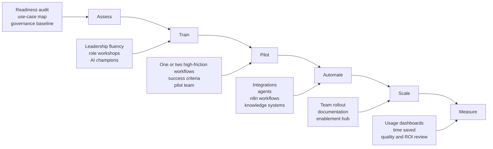
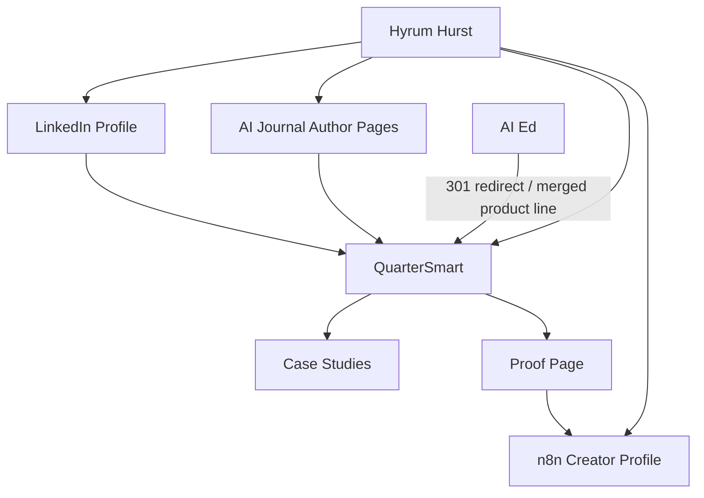

> **CANONICAL STRATEGY DOC** (supersedes `quartersmart-positioning-blueprint.md`).
>
> ⚠️ **OWNER OVERRIDE (2026-06-08): NO LMS. AT ALL.**
> Hyrum's explicit direction: QuarterSmart is **not** to be positioned, named, or described around an
> LMS, course studio, "rollout hub LMS," or training-content product in **any** public-facing way.
> This overrides the playbook section below that recommends keeping a "developer-forward LMS / Rollout
> Hub and Enablement Layer." The underlying capability (secure knowledge systems, AI assistants, secure
> deployment) may still exist — but **never branded or led as an LMS**. Drop the "Rollout Hub and
> Enablement Layer (developer-forward LMS)" service entirely; fold any genuinely needed pieces into
> "Knowledge Systems & AI Assistants" or "Custom Systems & Secure Deployment." See `../docs/REBRAND_PLAN.md`.
>
> (Inline research-tool citation artifacts removed for readability; substance unchanged.)

---

# DualLogic Audit and QuarterSmart Positioning Playbook

## Executive summary

Dual Logic's public positioning is strong because it does **not** present itself as a generic AI agency or an automation freelancer. It presents as an **AI integration consultancy** that helps leaders move from curiosity to capability through a clear, end-to-end journey: strategy, training, implementation, and engineering. Its site is organized around business outcomes, organizational adoption, internal capability-building, and proof. It packages the buyer journey into visible entry offers, uses vertical-industry pages, and backs its claims with customer stories, testimonials, and role-specific buying language aimed at CEOs, CIOs, GMs, and functional leaders.

QuarterSmart's current public positioning undersells Hyrum Hurst's best marketable edge. Today, QuarterSmart is still framed primarily as an **AI-powered LMS plus course development studio**, with pricing anchored around a low-ticket training-system buildout and monthly management. AI Ed, meanwhile, is framed as a secure AI training and implementation layer "powered by QuarterSmart Secured LMS." That split makes the market read QuarterSmart as a training-content/LMS company first, not as an AI rollout partner first, and it fragments the entity graph around Hyrum, QuarterSmart, and AI Ed.

The most practical move is to **mirror Dual Logic's structure but not its exact identity**. QuarterSmart should become a **full-scale AI implementation and workforce enablement partner** with a plainly stated rollout method: **Assess → Train → Pilot → Automate → Scale → Measure**. [OWNER OVERRIDE applies here: the original playbook said to keep the LMS as a "developer-forward rollout artifact." Per Hyrum, drop LMS framing entirely — the secure enablement/knowledge-system capability stays, but is never positioned as an LMS.]

Hyrum's strongest public credibility signals are the ones that already connect implementation to real work: public n8n creator status, 25 public workflow templates, and QuarterSmart-branded workflow authorship across operational, lead-routing, property-management, and compliance use cases. Those assets are much closer to a "rollout partner" story than the current LMS-first framing. The safest immediately verifiable proof line is: **Verified n8n creator with 25 public workflow templates**. The "Top 50" and "10K+ uses" claims may still be worth publishing, but they should be paired with a proof page or screenshot because the exact rank and aggregate usage total could not be independently verified from the public page output.

## How Dual Logic is positioned

### What Dual Logic is publicly selling

Dual Logic's homepage promise is aimed at leadership and organizational transformation, not just tool setup. Its hero says it helps CEOs accelerate AI strategy without the organization falling behind, and its "end-to-end AI integration support" section explicitly combines **strategy, training, implementation, and engineering** into one program anchored to KPIs and compounding progress. Its "Why Dual Logic" page reinforces five principles: full-journey partnership, AI as an accelerant of craft, human-centric integration, practical over theoretical work, and a compounding adoption path.

The official services architecture is unusually coherent. Strategy covers readiness diagnostics, opportunity mapping, governance, build-vs-buy-vs-partner analysis, scoped KPIs, and phased roadmaps. Implementation covers tool selection, data preparation, systems integration, workflow automation, rollout support, validation, ROI monitoring, and retainer-style optimization. Training covers leadership enablement, role-specific workshops, org-wide fluency, champions, coaching cohorts, durable resources, and ongoing support. Engineering covers custom applications, agents, RAG/knowledge systems, security/compliance, and fine-tuning.

Its public offer ladder also reduces buyer uncertainty. The site shows a **~10-week AI Integration Leadership Program** for organizations that need internal champions before implementation, and a **~2-week AI Integration Assessment** for AI-savvy organizations that want prioritized opportunities and a roadmap. That is important: Dual Logic is not asking buyers to begin with a vague "contact us." It is asking them to choose a credible starting point.

Public proof is another major strength. Case stories show outcomes across multiple engagement types: Emburse built executive fluency, identified 40+ use cases, enabled 30+ leaders, and produced a 2026 roadmap; ACS Publications built Microsoft 365 Copilot fluency for a transformation team and a roadmap for a 400-person division; Paperclip used AI-augmented execution to reach 50+ MQLs per month with campaign performance 2–3x above benchmarks and 4–5x more efficient cost per lead; CoSo Cloud received a validated FedRAMP-compliant implementation path using Salesforce Agentforce to scale support without adding headcount or new compliance reviews.

Its target customers are also legible. The site lists industry pages for consulting, financial services, private equity, nonprofits and social impact, retail, SaaS, travel and leisure, and associations. The contact form asks prospects to self-select Strategy, Implementation, Training, Engineering, or Partnership. The LinkedIn company page describes Dual Logic as serving small to mid-sized organizations and lists a 2–10 employee company size. Testimonials and case studies point to economic buyers and sponsors including CEOs, CIOs, GMs, marketing directors, transformation teams, IT, and L&D leaders.

### Offer decomposition

| Dimension | Dual Logic public position |
|---|---|
| Core promise | AI integration and advisory for organizations moving from "AI is interesting" to "AI is integral." |
| Service lines | Strategy, Implementation, Training, Engineering |
| Typical deliverables | Readiness scorecards, opportunity matrices, governance frameworks, roadmaps, tool/vendor recommendations, integrations, workflow automations, role-specific training, champion networks, custom apps, agents, RAG systems |
| Process model | Build fluency first, then strategy, then smart bets, then scale; governance and enablement are emphasized early |
| Entry offers | AI Integration Leadership Program (~10 weeks); AI Integration Assessment (~2 weeks) |
| Pricing signals | No public consulting pricing visible; offer durations are public; a Paperclip case references AI-augmented execution within ~50 hours/month; public service pricing otherwise unspecified |
| Target customers | Small to mid-sized organizations; CEO/CIO/GM level economic buyers; IT, L&D, marketing, transformation, and operations sponsors |
| Target industries | Associations, consulting, financial services, private equity, nonprofits/social impact, retail, SaaS, travel/leisure |
| Proof architecture | Customer stories with concrete outcomes, executive testimonials, named logos, vertical pages, insight/newsletter content |
| Messaging stance | Human-centric, practical, tool-agnostic, "start with what you have," measurable outcomes, long-term capability-building |

### Why the positioning works

Dual Logic's messaging succeeds because it turns AI adoption into an **organizational operating problem**, not a technology shopping problem. Its public insight themes and LinkedIn posts repeatedly attack "side-of-desk AI," fragmented experimentation, tool hype, and training-without-follow-through. In other words, the company wins by sounding like a strategic rollout partner who understands governance, fear, manager bandwidth, and adoption friction as much as models and automations.

It also avoids the trap of sounding like an "automation guy." Even where implementation is technical, the language stays anchored to business outcomes, existing-tool leverage, human oversight, internal champions, and change management. That makes buyers feel safer. It broadens the buying committee. And it creates room for higher-value engagements than one-off workflow builds.

## What QuarterSmart should become

### The recommended shift

QuarterSmart should reposition from **"AI-powered LMS plus course studio"** to **"AI implementation and workforce enablement partner."** The present public sites lean heavily on LMS, course production, SOP conversion, AI video generation, chatbot training, and low-ticket platform pricing. AI Ed adds secure deployment language, but still centers the delivery mechanism more than the transformation outcome. That makes the offer look narrower, cheaper, and more training-vendor-like than Hyrum's public workflow work suggests it really is.

The stronger position is this: **QuarterSmart helps organizations implement AI and make their workforce capable of using it at scale.** The actual work happens across assessment, training, piloting, automation, rollout, governance, measurement, and optional secure deployment.

> **OWNER OVERRIDE:** The original playbook continued: "The LMS then becomes a supporting asset — a rollout hub, AI knowledge layer, prompt/system library, and adoption environment." **Per Hyrum, this is dropped — no LMS framing at all.** Keep only the non-LMS capabilities (knowledge systems / AI assistants / secure deployment), never branded as an LMS or training platform.

### The mirrored but differentiated QuarterSmart offer

The right mirror of Dual Logic is not a copy of its names. It is a copy of its **architecture**: strategy + enablement + implementation + engineering, with stronger QuarterSmart-specific proof around operational workflows, developer-forward delivery, and n8n-backed execution.

Recommended QuarterSmart offer map (LMS row from the original removed per owner override):

| QuarterSmart offer | Recommended positioning | Core deliverables |
|---|---|---|
| AI Rollout Assessment | Fixed-fee diagnostic for leaders who need clarity fast | Readiness audit, use-case matrix, workflow map, governance baseline, 90-day roadmap, tool guidance |
| AI Power User and Champion Sprint | Workforce enablement before organization-wide rollout | Leadership sessions, role-based workshops, prompt/workflow library, champions cohort, office hours |
| Pilot and Automation Build | Prove value in one or two high-friction workflows | Workflow design, n8n-based automations, AI task routing, QA criteria, pilot launch, docs |
| Full Rollout Program | End-to-end adoption across a business unit or operating team | Sequenced rollout plan, change support, team enablement, KPI dashboard, governance guardrails |
| Custom Systems and Secure Deployment | Developer-forward builds when standard tools are not enough | Internal tools, retrieval systems, agent workflows, secure hosting, on-prem/private deployment |
| Knowledge Systems & AI Assistants | Answers grounded in the client's own SOPs/docs/data | RAG knowledge layer, internal AI assistants, source-grounded Q&A (NOT an LMS/course product) |
| Scale and Measurement Retainer | Ongoing optimization and expansion | Monthly ROI review, new workflow backlog, retraining, rollout support, champion calls, reporting |

### The right credibility stack

- **Founder, QuarterSmart**
- **AI implementation and workforce enablement**
- **Verified n8n creator with 25 public workflow templates**
- **Public workflows spanning property operations, lead routing, compliance, notifications, and AI-assisted execution**
- **Secure deployment capability when required**

n8n public pages confirm the creator profile, 25 workflows, and QuarterSmart-branded authorship across multiple automation patterns. Do **not** publish a precise "Top 50" ranking or "10K+ uses" total without a proof page (official directory screenshot or other on-record corroboration).

## Recommended website copy

### Homepage

#### Hero variants

| Hero headline | Supporting subhead | Suggested proof line |
|---|---|---|
| AI implementation and workforce enablement for teams that need rollout, not hype. | QuarterSmart helps organizations assess opportunities, train leaders, pilot high-friction use cases, automate real work, and scale what proves out. | Strategy, training, automation, rollout, and measurement in one program. |
| From AI curiosity to organization-wide capability. | We turn scattered experiments into a practical rollout plan your team can actually use. | Built for operational teams, service teams, and modernizing organizations. |
| Assess. Train. Pilot. Automate. Scale. Measure. | A full-scale AI rollout partner for companies that need outcomes and internal capability, not just demos. | QuarterSmart combines implementation, enablement, and developer-forward delivery. |
| Practical AI rollout for organizations with real workflows, real people, and real constraints. | We help leadership choose where AI fits, help teams use it well, and help operations deploy it safely. | Start with one assessment. Grow into a rollout system. |
| Build AI into how your team actually works. | QuarterSmart designs, deploys, and enables the workflows and systems that make adoption stick. | Verified n8n creator with 25 public workflow templates. |

#### Homepage structure

| Section | Recommended copy concept |
|---|---|
| Hero | AI implementation and workforce enablement (NOT LMS) |
| Proof strip | "Used by teams that need real rollout support" plus workflow, property, compliance, and ops proof |
| Problem section | "Where AI adoption gets stuck: hype, scattered pilots, low fluency, no owner, no ROI tracking" |
| Rollout section | Explain Assess → Train → Pilot → Automate → Scale → Measure |
| Services section | Service cards mapped to the new offer architecture |
| Proof section | 2–3 short case stories with outcomes, even if one starts as a "pilot" case |
| Founder section | Hyrum as implementation leader, not course builder |
| CTA | "Book an AI Rollout Assessment" and "See how QuarterSmart works" |

#### Suggested homepage body copy

**Primary headline**  
**AI implementation and workforce enablement for teams that need rollout, not hype.**

**Subhead**  
QuarterSmart helps organizations identify the right AI opportunities, build workforce fluency, pilot high-friction workflows, automate real work, and scale what proves out — with the systems, enablement, and technical delivery required to make adoption stick.

**Proof bar**  
Strategy-led. Developer-forward. Built for real operations. Secure when needed. Verified n8n creator with 25 public workflow templates.

**Problem section**  
Most AI initiatives stall for the same reasons: unclear priorities, scattered experiments, low team fluency, weak rollout ownership, and no measurement once a pilot launches. QuarterSmart fixes that with a structured rollout model that combines assessment, training, workflow delivery, and adoption support.

### Services page blurbs

| Service | Blurb |
|---|---|
| AI Rollout Assessment | We audit readiness across people, process, tools, and data; identify the most valuable near-term use cases; and give leadership a realistic roadmap with priorities, guardrails, and budget logic. |
| Leadership and Team Enablement | We train leaders, managers, and frontline teams to use AI in context — not as passive attendees, but as people responsible for real workflows and outcomes. |
| Pilot Design and Workflow Prototyping | We pick one or two high-friction use cases, define success criteria, and launch controlled pilots that prove where AI genuinely helps and where it does not. |
| Workflow Automation and Systems Integration | We build the automations, integrations, and task-routing systems that move AI from experiments into day-to-day operations. |
| Knowledge Systems and AI Assistants | When your team needs answers grounded in your own SOPs, documents, or internal data, we build the right knowledge layer instead of forcing generic chat onto the problem. |
| Measurement and Optimization | We track usage, quality, time savings, operational impact, and adoption friction so expansion decisions are based on evidence. |

> (Original playbook included a "Rollout Hub and Enablement Layer / developer-forward LMS" service here. **Removed per owner override — no LMS.**)

### About page copy

**About headline**  
**QuarterSmart helps organizations implement AI without losing the human systems that make the work run.**

**Short founder bio**  
Hyrum Hurst is the founder of QuarterSmart, an AI implementation and workforce enablement company focused on helping organizations move from experimentation to full-scale rollout. His work sits at the intersection of AI adoption, workflow automation, hands-on team enablement, and developer-forward deployment. Publicly, he is a verified n8n creator with 25 workflow templates and QuarterSmart-branded automations across lead routing, compliance, operations, and property workflows.

**About body copy**  
QuarterSmart was not built to sell an empty platform or a one-off workshop. It was built to help organizations assess where AI fits, train the people responsible for using it, deploy working systems, and measure what actually changes. When a workflow needs custom build work, QuarterSmart ships it. The point is operational adoption.

### Short case study template

| Field | Template |
|---|---|
| Headline | How [Client] reduced [pain] and launched [AI workflow / rollout result] without [headcount / tool sprawl / security tradeoff] |
| Client snapshot | [Industry], [size], [team], [context] |
| Challenge | What was breaking, slowing down, or scaling poorly |
| What QuarterSmart did | Assessment, training, pilot, automation, rollout, measurement |
| Solution components | Systems integrated, workflows built, enablement delivered |
| Outcome | 3–5 metrics or concrete operational improvements |
| Quote | One buyer-level quote from CEO/CIO/ops leader |
| Why it mattered | Strategic takeaway and next phase |

### SEO-friendly meta titles and descriptions

| Page | Meta title | Meta description |
|---|---|---|
| Homepage | AI Implementation and Workforce Enablement for Teams | QuarterSmart helps organizations assess AI opportunities, train teams, pilot workflows, automate operations, and scale adoption with measurable results. |
| Services | AI Rollout Services for Strategy, Training, Automation and Scale | Explore QuarterSmart's AI rollout services: readiness assessments, workforce enablement, workflow automation, secure deployment, and ROI measurement. |
| About | About Hyrum Hurst and QuarterSmart | Learn how Hyrum Hurst and QuarterSmart help organizations implement AI, enable teams, and scale working systems beyond scattered pilots. |

## Pricing and sales design

Dual Logic does not appear to publish consulting prices publicly, but it does publish **time-bounded entry offers** — a ~2-week assessment and a ~10-week leadership program. QuarterSmart, by contrast, is currently anchored to **$2,500–$4,000 buildouts** and **$800–$1,500 monthly management**, which reinforces an "AI training system vendor" perception. To feel like a strategic rollout firm, the public pricing architecture has to move accordingly.

### Recommended packages

| Package | Price range | Typical duration | Best fit | Deliverables |
|---|---:|---|---|---|
| AI Rollout Assessment | $7,500–$15,000 | 2 weeks | Leadership teams who need clarity before doing anything bigger | Readiness audit, use-case matrix, buyer/sponsor interviews, governance baseline, tool guidance, 90-day roadmap |
| Power User and Champion Sprint | $15,000–$30,000 | 4–6 weeks | Teams that need fluency and internal champions before rollout | Leadership workshops, role-based sessions, prompt/workflow library, cohort calls, champion plan |
| Pilot and Automation Build | $20,000–$45,000 | 4–8 weeks | Teams with one or two urgent workflows to prove ROI | Workflow design, implementation, integrations, QA criteria, pilot launch, docs, measurement dashboard |
| Full Rollout Program | $45,000–$90,000+ | 8–12 weeks | Business units ready for end-to-end implementation | Assessment refresh, enablement, 2–5 workflows, governance support, KPI reporting |
| Scale Retainer | $6,000–$15,000/mo | Ongoing | Clients expanding from pilot to program | Optimization, champion support, new workflows, reporting, retraining, quarterly roadmap reviews |
| Secure Deployment / Custom Systems | Custom | Custom | Regulated or complex environments | Private deployment, internal assistants, RAG, observability, auditability, role-based rollout support |

### Recommended sales process

| Stage | Goal | Output |
|---|---|---|
| Qualification call | Confirm urgency, sponsor, workflow pain, and rollout appetite | Fit / no-fit decision |
| Discovery interviews | Understand people, process, systems, and constraints | Opportunity map |
| Assessment proposal | Sell a bounded first engagement | Signed fixed-fee assessment |
| Readout meeting | Turn findings into a pilot and rollout decision | Budgeted next-phase scope |
| Pilot kickoff | Start with one or two workflows and one enablement lane | Early proof |
| Executive review | Decide to scale, pause, or refine | Expansion plan |

### Lead qualification questions

| Question | Why it matters |
|---|---|
| What business unit owns the problem you want AI to improve? | Forces operational specificity |
| What is the highest-friction workflow today? | Surfaces real use cases |
| Who is the executive sponsor? | Prevents side-of-desk projects |
| What tools and systems are already in place? | Supports "start with what you have" selling |
| What has your team already tried? | Distinguishes curiosity from readiness |
| Where would a failed rollout create risk? | Reveals governance and change needs |
| Do you need fluency before implementation, or implementation before broader rollout? | Sorts buyer into the right package |
| What would count as a win in 90 days? | Produces scoping criteria |
| How sensitive is the data involved? | Determines architecture and compliance posture |
| If this works, where would you scale next? | Signals long-term account value |

## Authority consolidation and the 90-day launch plan

QuarterSmart's public identity is currently split across QuarterSmart, AI Ed, n8n creator pages, and external author bios. AI Ed openly identifies itself as "powered by QuarterSmart Secured LMS," and its FAQ says AI Ed is QuarterSmart's enterprise AI implementation product line. Separately, an AI Journal author bio still identifies Hyrum as founder of **AI Ed and QuarterSmart**. That fragmentation produces mixed search answers and weaker identity resolution.

Future state: **Hyrum Hurst → QuarterSmart** as the main entity; AI Ed either redirects into QuarterSmart or survives only as a clearly subordinate product page; n8n, LinkedIn, author bios, and case studies all point back to the same core description. Other same-name search results exist (athletics, entertainment), so the best tactic is building a denser, more coherent professional web footprint around the desired entity.

### The 90-day launch checklist

| Window | Priority actions | Outcome |
|---|---|---|
| First month | Rebuild homepage around AI implementation and workforce enablement; create `/ai-rollout-assessment/`, `/services/`, `/about-hyrum-hurst/`, `/who-is-hyrum-hurst/`, `/case-studies/`, `/industries/property-management-ai/`; add Person + Organization schema; rewrite all bios to one canonical description; keep AI Ed live only if it 301s or clearly nests under QuarterSmart | Core narrative shifts from LMS-first to rollout-first |
| Second month | Publish 3 authority pieces under QuarterSmart: "What AI implementation actually looks like," "Assess → Train → Pilot → Automate → Scale → Measure," and "Why most AI pilots never scale"; publish one n8n proof page; launch 2 case studies; update author bios anywhere editable | Search and citation surfaces begin to reinforce one identity |
| Third month | Guest posts and backlink campaign: AI operations, property management ops, workflow automation, and workforce enablement; appear on podcasts/webinars; convert AI Ed mentions to QuarterSmart mentions where possible; add social proof snippets, testimonial collection, and press-ready founder bio | Professional entity density increases; weaker same-name identities get crowded out |

### What to publish first

| Priority | Page | Purpose |
|---|---|---|
| Highest | Homepage | Reposition the company in one move |
| Highest | About Hyrum Hurst | Give search engines a canonical answer to "who is Hyrum Hurst?" |
| Highest | AI Rollout Assessment | Create a clear entry offer like Dual Logic's |
| High | Services | Show end-to-end architecture, not just one-off work |
| High | Property Management AI Implementation | Match public n8n workflow proof to a target vertical |
| High | n8n Workflow Proof | Turn creator credibility into conversion proof |
| High | Case studies hub | Create durable evidence |
| Medium | AI Ed redirect/product note | Prevent brand confusion |
| Medium | FAQ page | Help answer engines with direct entity questions |

### Exact phrasing to repeat across web properties

| Phrase | Use it where |
|---|---|
| **AI implementation and workforce enablement** | Homepage H1/H2, About page, bio |
| **Full-scale AI rollout** | Services page, case studies, social bios |
| **Assess → Train → Pilot → Automate → Scale → Measure** | Homepage, services, talk abstracts |
| **Developer-forward AI rollout** | Services page, About page, technical proofs |
| **QuarterSmart helps organizations move from AI curiosity to operational adoption** | Homepage and About |
| **Built for real workflows, real teams, and measurable outcomes** | Homepage proof strip, sales decks |
| **Verified n8n creator with 25 public workflow templates** | Proof page, bio, trust bar |
| **Secure deployment when the environment requires it** | Services, government/regulated pages |

**Stop repeating** phrases that pull the market toward the wrong bucket: "AI LMS company," "instructional design studio," "course development first," "automation freelancer," "chatbot builder." **(Per owner: drop ALL LMS / course / training-platform language entirely.)**

## Competitive differentiation and message guardrails

### Dual Logic versus proposed QuarterSmart

| Dimension | Dual Logic | Proposed QuarterSmart |
|---|---|---|
| Category | AI integration consultancy with strategy, training, implementation, and engineering | AI implementation and workforce enablement partner |
| Starting point | 2-week assessment or 10-week leadership program | Fixed-fee rollout assessment or champion sprint |
| Core narrative | Human-centric adoption, practical outcomes, compounding capability, existing-tool leverage | Same strengths, but more build-forward and operations-forward |
| Public proof | Named case studies, leadership testimonials, industry pages, newsletter insights | n8n workflow proof, implementation pages, stronger founder/entity pages, operational case studies |
| Technical flavor | Integrations, automation, custom apps, agents, RAG, compliance-aware engineering | n8n-led workflow automation, secure deployment, property/ops workflow systems |
| Risk | Can feel broad and advisory-heavy | Can feel like "solo automation builder" unless repositioned (and must avoid LMS framing) |

### How not to sound like an automation-only freelancer

QuarterSmart should avoid copy that centers tools, hacks, or "I can build you an agent." That language shrinks the buyer, lowers price expectations, and excludes the managers who actually have adoption problems. Instead, describe itself as the partner that owns the messy middle between AI enthusiasm and operational reality.

| Say more of this | Say less of this |
|---|---|
| AI rollout | AI hacks |
| Workforce enablement | Prompt tricks |
| High-friction workflow automation | Cool automations |
| Internal champions | One-time workshop |
| Measured rollout | Custom chatbot |
| Existing-tool leverage | Tool-stack obsession |
| Business-unit adoption | "I build in n8n" as the main pitch |
| (and never:) AI implementation partner | LMS / course platform / training studio |

## Sample one-page case study for Structure Properties

This is a **publishable case study scaffold**. It uses public company context from Structure Properties and public workflow proof from Hyrum's QuarterSmart-branded n8n templates. Replace bracketed metrics with verified internal numbers before publishing. Structure Properties publicly describes itself as a San Francisco property management company with 500 buildings managed, 2,000 tenants, $1.6B portfolio value, and 55+ staff. Hyrum's public workflow portfolio includes tenant document compliance, maintenance escalation, complaint triage, inspections, package/visitor alerts, and move-out coordination use cases.

### Draft case study

**Headline** — **How Structure Properties modernized property operations with AI-assisted workflow rollout**

**Client** — Structure Properties is a Bay Area property management company serving San Francisco owners and managing a large operating footprint across buildings, tenants, and owner-service workflows (publicly: 500 buildings, 2,000 tenants, $1.6B portfolio, 55+ staff).

**Challenge** — Property operations teams deal with repetitive but important work: maintenance follow-up, tenant complaint triage, document compliance, inspections, package and visitor alerts, move-out coordination, and internal reporting. These processes are operationally heavy, easy to delay, and difficult to scale cleanly across teams and properties.

**What QuarterSmart did** — Ran a short assessment of operational bottlenecks, mapped the highest-friction service workflows, trained the internal team on AI-assisted process handling, and launched a pilot combining workflow automation, internal routing, and role-based enablement. First focus: tenant document compliance, unresolved maintenance escalation, complaint triage, and move-out task coordination.

**Solution** —
1. **Workflow assessment** to identify the right first automations
2. **Role-specific enablement** for property and ops staff
3. **n8n-based automation** for routing, reminders, and status handling
4. **Adoption support** for SOP delivery and workflow guidance *(non-LMS)*

**Outcomes** (replace bracketed fields with verified numbers):
- [X]% faster response time on maintenance escalation
- [X] fewer manual follow-up touches per complaint
- [X]% improvement in document compliance turnaround
- [X] hours per week returned to property operations staff
- Stronger operational visibility across workflows that previously lived in email, spreadsheets, or team memory

**Why it mattered** — For a property manager, scaling well is rarely about one dramatic AI feature. It is about tightening the operating system underneath recurring tenant, owner, and staff workflows.

**Client quote placeholder** — "QuarterSmart helped us move from 'we should automate this' to a rollout we could actually operate. The value was not just the workflows — it was the way the team adopted them."

## Open questions and limitations

- Dual Logic's consulting pricing is **not publicly specified**; only offer durations and packaged starting points are visible.
- Hyrum's n8n creator profile independently confirms **25 workflow templates** and public QuarterSmart-branded authorship. The exact **"Top 50" rank** and **"10K+ uses"** total could **not** be independently verified — publish only with a supporting proof page/screenshot.
- Some LinkedIn details were inaccessible (robots restrictions); the audit prioritized official Dual Logic pages, official case stories/testimonials, current QuarterSmart/AI Ed pages, and official n8n pages.
